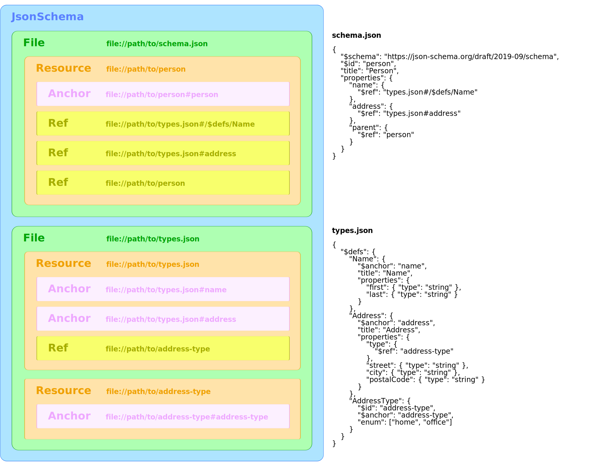

Understanding Schema Structure
========================================
The [`JsonSchema` object](json-schema.md) is an object model representation of your entire JSON Schema. It includes detailed information about each file in your schema, and provides data structures that make it easy to inspect important parts of each file.  This page explains the concepts of the object model.


Example
------------------------
Consider the following JSON Schema that is composed of 2 files. The file contents are shown on the right. On the left, you see a visual representation of the corresponding `JsonSchema` object model.




The `JsonSchema` Object
--------------------------
The [`JsonSchema` object](json-schema.md) is always the top-level object. It represents your entire schema, regardless of how many files it's composed of. A valid `JsonSchema` object will always have at least one file (the `rootFile`), which will have at least one resource (the `rootResource`).  Even the most simple, single-file JSON Schema will consist of at least one file and one resource.

In [our example above](#example), the `JsonSchema` object contains two files. That is, it's `files` array has two `File` objects in it. One of the files has a single resource, while the other file contains two resources.


Files
-------------------
Each [`File` object](file.md) corresponds to a physical file on disk or URL that was downloaded.

The file's `url` property is the absolute URL of the file. This will be a `file://` URL for files read from the filesystem, or an `http://` or `https://` URL for downloaded files. Note that it's a [UR**L** (Uniform Resource Locator)](https://en.wikipedia.org/wiki/URL) because it specifies the physical location of the file, as opposed to the [UR**I** (Uniform Resource Identifier)](https://en.wikipedia.org/wiki/Uniform_Resource_Identifier) that resources, anchors, and references have, which are simply identifiers and may not correspond to a physical file anywhere.

In [our example above](#example), the schema has two files: **schema.json** and **types.json**.


Resources
--------------------
Each file in a JSON Schema will always have at least one [`Resource` object](resource.md), but can have more than one.  A resource is a schema that is identified by a [URI (Uniform Resource Identifier)](https://en.wikipedia.org/wiki/Uniform_Resource_Identifier).

Depending on the version of JSON Schema being used, the syntax for defining a resource URI varies. For example, [the 2019-09 spec used the `$id` keyword](https://json-schema.org/draft/2019-09/json-schema-core.html#rfc.section.8.2.2), wheras [earlier versions used the `id` keyword](https://json-schema.org/draft-04/json-schema-core.html#rfc.section.7.2) (without a dollar sign).

In [our example above](#example), the **schema.json** file has an `$id` keyword at the top level, which defines the URI for the file's root resource. The `$id` (`person`) is resolved relative to the file's URL (`file://path/to/schema.json`), so the resulting resource URI is `file://path/to/person`.

In the **types.json** file, the root resource has no `$id` keyword, so its URI is the same as the file's URL (`file://path/to/types.json`). This resource contains three nested schema definitions (`Name`, `Address`, and `AddressType`), but only `AddressType` has an `$id` keyword, so only it becomes a separate resource.  `Name` and `Address` are simply sub-schemas in the root resource.

> **WARNING:** Adding an `$id` keyword creates a resource, which alters how references and anchors within that resource are resolved. This can break references that previously worked, so be sure you know what you're doing.

### Canonical URI
A resource always has a single, absolute, canonical URI, which is defined by its `$id` keyword, resolved against the parent resource URI or file URL. For example, the `AddressType` schema's `$id` is `address-type`.  Its parent resource is the root resource of the **types.json** file, which has a URI of `file://path/to/types.json`.  Therefore, the canonical URI of the `AddressType` schema is:

```
file://path/to/address-type
```

### Non-Canonical URIs
In addition to the canonical URI, a resource can be referenced by non-canonical URIs. For example, each of the following URIs also references the `AddressType` schema in [our example above](#example):

#### File URL + JSON Pointer Fragment
This URI uses a [JSON Pointer fragment](https://json-schema.org/draft/2019-09/json-schema-core.html#embedded), relative to the file URL.

```
file://path/to/types.json#/$defs/AddressType
```

#### Resource URI + Empty JSON Pointer Fragment
This URI uses a [JSON Pointer fragment](https://json-schema.org/draft/2019-09/json-schema-core.html#embedded), relative to the resource URI. Note that an empty fragment points to the whole resource.

```
file://path/to/address-type#
```

#### Resource URI + Anchor
This URI uses a plain-name fragment, which is defined by [the `$anchor` keyword](https://json-schema.org/draft/2019-09/json-schema-core.html#anchor). Notice that the anchor is relative to the resource URI, _not_ the file URL.

```
file://path/to/address-type#address-type
```


Anchors
----------------------
An [`Anchor` object](anchor.md) identifies a sub-schema within a resource via a plain-name fragment. They're created using [the `$anchor` keyword in JSON Schema](https://json-schema.org/draft/2019-09/json-schema-core.html#anchor).

Like resources, anchors have a [URI (Uniform Resource Identifier)](https://en.wikipedia.org/wiki/Uniform_Resource_Identifier), but anchor URIs _don't_ create a new resource and _don't_ alter the resolution scope of other URIs.

> **NOTE:** Unlike the `$id` keyword, it's safe to add an `$anchor` to a schema without worrying about breaking other anchors or references.

In [our example above](#example), the `Name` and `Address` schemas in **types.json** each have an `$anchor` keyword, which allows them to be referenced using plain-name fragments, like this:

```
file://path/to/types.json#name
file://path/to/types.json#address
```

The `AddressType` schema in **types.json** also has an `$anchor` keyword, but since the `AddressType` schema is a resource (it has an `$id` keyword), the anchor is relative to the resource's URI:

```
file://path/to/address-type#address-type
```


References
-------------------------
A [`Reference` object](reference.md) will be created for every `$ref` in your JSON Schema. References point to another value in the schema, which can be in the same file or a different file.

Like anchors, references are relative to their parent resource URI. In [our example above](#example), the `name` and `address` properties in **schema.json** both reference the **types.json** file, whereas the `parent` property referenes its own parent resource.

In **types.json**, there's a `$ref` that points to `address-type`. When resolved against the parent resource URI (`file://path/to/types.json`), it points to the `AddressType` resource URI (`file://path/to/address-type`).
